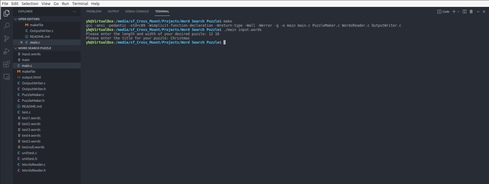
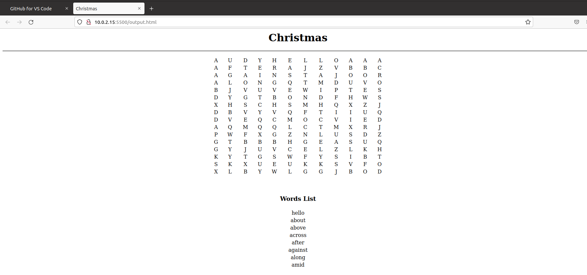

# Duration of Project
Project took approximately 20 hours. 

# Introduction 
My project is a word search puzzle generator. 

Given a .words file as a the first argument to the program with a list of words, the program will ask the user for the size of the puzzle. Then, it will develop a 2-d array containing the words given and random characters. The program will output the array in a HTML file (name given by user).

The program will ask the user for the length and width of their desired word search puzzle as well as the title for their crossword puzzle. The program will appropriately output the puzzle and list of words given to the output file. 

# Example

# Output

